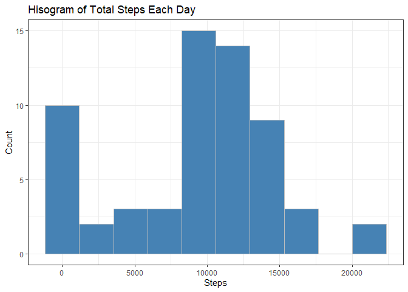
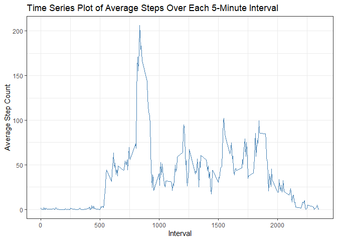
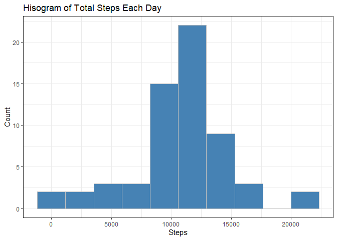
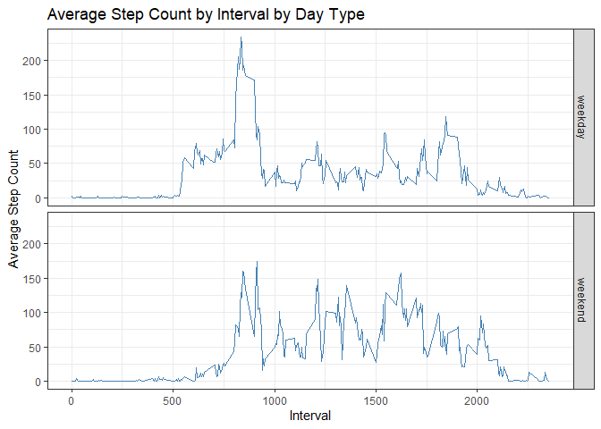

```r
# set working directory
setwd("C:\\Users\\Jed\\iCloudDrive\\Documents\\Learn\\R\\Johns Hopkins Data Science Specialization\\5 Reproducible Research\\Week 1\\Project 1")

# load packages
library(ggplot2)
library(dplyr)
library(lubridate)
```

### # ETL

---

Now we're going to load and inspect the data.

```r
# load the data
df <- read.csv(".\\data\\activity.csv")

# inspect the data
head(df)
```

```
##   steps       date interval
## 1    NA 2012-10-01        0
## 2    NA 2012-10-01        5
## 3    NA 2012-10-01       10
## 4    NA 2012-10-01       15
## 5    NA 2012-10-01       20
## 6    NA 2012-10-01       25
```

```r
str(df)
```

```
## 'data.frame':	17568 obs. of  3 variables:
##  $ steps   : int  NA NA NA NA NA NA NA NA NA NA ...
##  $ date    : chr  "2012-10-01" "2012-10-01" "2012-10-01" "2012-10-01" ...
##  $ interval: int  0 5 10 15 20 25 30 35 40 45 ...
```

It looks like the date column is in a character format. Let's convert it to a date object using lubridate.

```r
# convert date
df$date <- ymd(df$date)

# ensure it's converted
str(df$date)
```

```
##  Date[1:17568], format: "2012-10-01" "2012-10-01" "2012-10-01" "2012-10-01" "2012-10-01" ...
```

### # Analysis

---

**Q1: What is the average daily activity pattern?**

1. Calculate the total number of steps taken per day  

```r
# total number of steps by day
df1 <- df %>%
  group_by(date) %>%
  summarize(steps = sum(steps, na.rm = TRUE))
```

2. If you do not understand the difference between a histogram and a barplot, research the difference between them. Make a histogram of the total number of steps taken each day  

```r
# plot a histogram of the steps
ggplot(df1, aes(x = steps, fill = date)) + 
  geom_histogram(fill = "steelblue", color = "grey", bins = 10) + 
  theme_bw() + 
  ggtitle("Hisogram of Total Steps Each Day") + 
  xlab("Steps") + 
  ylab("Count")
```

<!-- -->

3. Calculate and report the mean and median of the total number of steps taken per day  

```r
# calculate mean and median and report the result
q1_mean <- mean(df1$steps)
q1_median <- median(df1$steps)
print(paste("The mean is", q1_mean, "steps and the median is", q1_median, "steps."))
```

```
## [1] "The mean is 9354.22950819672 steps and the median is 10395 steps."
```
**Q2: What is the average daily activity pattern?**

1. Make a time series plot (i.e. type = "l") of the 5-minute interval (x-axis) and the average number of steps taken, averaged across all days (y-axis)

```r
# create a sub-df that has the average steps by interval
df2 <- df %>%
  group_by(interval) %>%
  summarize(avg = mean(steps, na.rm = TRUE))

# plot
ggplot(df2, aes(x = interval, y = avg)) + 
  geom_line(color = "steelblue") + 
  theme_bw() + 
  ggtitle("Time Series Plot of Average Steps Over Each 5-Minute Interval") + 
  xlab("Interval") + 
  ylab("Average Step Count")
```

<!-- -->


2. Which 5-minute interval, on average across all the days in the dataset, contains the maximum number of steps?

```r
# determine maximum and print the result
q2_int_max <- df2[df2$avg == max(df2$avg), ][[1]]
print(paste("The interval with the maximum average step count is ", q2_int_max, ".", sep = ""))
```

```
## [1] "The interval with the maximum average step count is 835."
```
**Q3: Imputing missing values**

1. Calculate and report the total number of missing values in the dataset (i.e. the total number of rows with NAs)

```r
# count number of rows with NAs
na_rows <- sum(!complete.cases(df))
print(paste("There are ", na_rows, " rows with NAs.", sep = ""))
```

```
## [1] "There are 2304 rows with NAs."
```

2. Devise a strategy for filling in all of the missing values in the dataset. The strategy does not need to be sophisticated. For example, you could use the mean/median for that day, or the mean for that 5-minute interval, etc.

I'll impute the average (mean) step count for that given interval.

3. Create a new dataset that is equal to the original dataset but with the missing data filled in.

```r
# create a new df (df3) that has the imputed mean by interval
df3 <- df %>%
  left_join(df2, by = "interval") %>%
  mutate(steps = ifelse(is.na(steps), avg, steps))
```


4. Make a histogram of the total number of steps taken each day and Calculate and report the mean and median total number of steps taken per day. Do these values differ from the estimates from the first part of the assignment? What is the impact of imputing missing data on the estimates of the total daily number of steps?

```r
# dataframe grouped by the date and with the total steps for each day
df3.4 <- df3 %>%
  group_by(date) %>%
  summarize(steps = sum(steps))

# plot
ggplot(df3.4, aes(x = steps, fill = date)) + 
  geom_histogram(fill = "steelblue", color = "grey", bins = 10) + 
  theme_bw() + 
  ggtitle("Hisogram of Total Steps Each Day") + 
  xlab("Steps") + 
  ylab("Count")
```

<!-- -->

```r
# mean and median and report the values
q3_mean <- mean(df3.4$steps)
q3_median <- median(df3.4$steps)
print(paste("The mean is ", q3_mean, " steps and the median is ", q3_median, " steps. This is different from the previous mean of ", q1_mean, " steps and previous median of ", q1_median," steps.", sep = ""))
```

```
## [1] "The mean is 10766.1886792453 steps and the median is 10766.1886792453 steps. This is different from the previous mean of 9354.22950819672 steps and previous median of 10395 steps."
```

```r
print("The impact of imputing, using my method, increased the mean and median of the step count.")
```

```
## [1] "The impact of imputing, using my method, increased the mean and median of the step count."
```
**Q4: Are there differences in activity patterns between weekdays and weekends?**

1. Create a new factor variable in the dataset with two levels – “weekday” and “weekend” indicating whether a given date is a weekday or weekend day.

```r
# define weekends
weekends <- c(1, 7)

# mutate to add factor variable
df4 <- df %>%
  mutate(day_end = ifelse(wday(date) %in% weekends, "weekend", "weekday")) %>%
  select(steps, date, interval, day_end = day_end)
```


2. Make a panel plot containing a time series plot (i.e. type = "l") of the 5-minute interval (x-axis) and the average number of steps taken, averaged across all weekday days or weekend days (y-axis). See the README file in the GitHub repository to see an example of what this plot should look like using simulated data.

```r
# final d4 dataframe that's grouped by the type and the interval
df4_clean <- df4 %>%
  group_by(day_end, interval) %>%
  summarize(avg = mean(steps, na.rm = TRUE))

# plot
ggplot(df4_clean, aes(x = interval, y = avg)) + 
  geom_line(color = "steelblue") + 
  facet_grid(rows = vars(day_end)) + 
  theme_bw() + 
  ggtitle("Average Step Count by Interval by Day Type") + 
  xlab("Interval") + 
  ylab("Average Step Count")
```

<!-- -->

