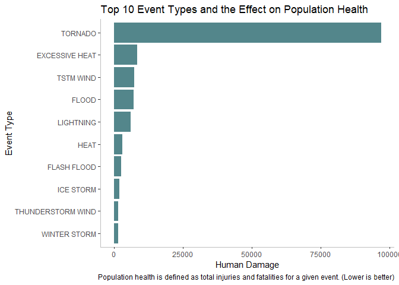
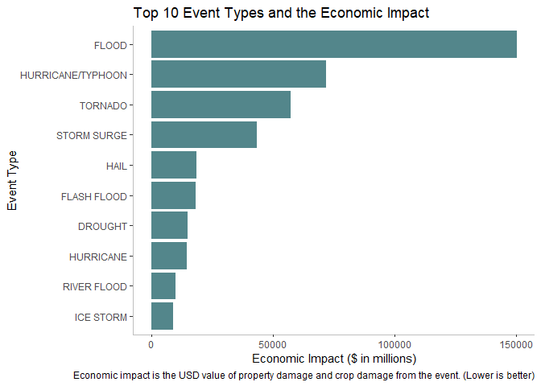

```r
# set working directory
setwd("C:\\Users\\Jed\\iCloudDrive\\Documents\\Learn\\R\\Johns Hopkins Data Science Specialization\\5 Reproducible Research\\Week 4\\Project 2")

# install packages
# install.packages("ggplot2")
# install.packages("dplyr")
# install.packages("lubridate")
# install.packages("data.table")

# load packages
library(ggplot2)
library(dplyr)
library(lubridate)
library(data.table)

# prevent scientific notation
options(scipen = 999)
```
## Severe Weather Events and the Effect on Population Health and the Economy

### # Synopsis
***

This analysis looks to quantify and plot the impact of natural disasters in the population and economy in the United States. The data used in this analysis is sourced from the US National Oceanic and Atmospheric Adminsitration's (NOAA) database. It is further sourced from the National Weather Service. The data spans from 1950 to the end of November 2011. Thus, all information presented, after any data transformation, is presented as the total for that date range.

### # Data Processing
***

First, I'm going to read in the file and inspect the data.

```r
# load the data
df <- read.csv(".\\Data\\repdata_data_StormData.csv.bz2")

# inspect the data
head(df)
```

```
##   STATE__           BGN_DATE BGN_TIME TIME_ZONE COUNTY COUNTYNAME STATE  EVTYPE
## 1       1  4/18/1950 0:00:00     0130       CST     97     MOBILE    AL TORNADO
## 2       1  4/18/1950 0:00:00     0145       CST      3    BALDWIN    AL TORNADO
## 3       1  2/20/1951 0:00:00     1600       CST     57    FAYETTE    AL TORNADO
## 4       1   6/8/1951 0:00:00     0900       CST     89    MADISON    AL TORNADO
## 5       1 11/15/1951 0:00:00     1500       CST     43    CULLMAN    AL TORNADO
## 6       1 11/15/1951 0:00:00     2000       CST     77 LAUDERDALE    AL TORNADO
##   BGN_RANGE BGN_AZI BGN_LOCATI END_DATE END_TIME COUNTY_END COUNTYENDN
## 1         0                                               0         NA
## 2         0                                               0         NA
## 3         0                                               0         NA
## 4         0                                               0         NA
## 5         0                                               0         NA
## 6         0                                               0         NA
##   END_RANGE END_AZI END_LOCATI LENGTH WIDTH F MAG FATALITIES INJURIES PROPDMG
## 1         0                      14.0   100 3   0          0       15    25.0
## 2         0                       2.0   150 2   0          0        0     2.5
## 3         0                       0.1   123 2   0          0        2    25.0
## 4         0                       0.0   100 2   0          0        2     2.5
## 5         0                       0.0   150 2   0          0        2     2.5
## 6         0                       1.5   177 2   0          0        6     2.5
##   PROPDMGEXP CROPDMG CROPDMGEXP WFO STATEOFFIC ZONENAMES LATITUDE LONGITUDE
## 1          K       0                                         3040      8812
## 2          K       0                                         3042      8755
## 3          K       0                                         3340      8742
## 4          K       0                                         3458      8626
## 5          K       0                                         3412      8642
## 6          K       0                                         3450      8748
##   LATITUDE_E LONGITUDE_ REMARKS REFNUM
## 1       3051       8806              1
## 2          0          0              2
## 3          0          0              3
## 4          0          0              4
## 5          0          0              5
## 6          0          0              6
```

```r
str(df)
```

```
## 'data.frame':	902297 obs. of  37 variables:
##  $ STATE__   : num  1 1 1 1 1 1 1 1 1 1 ...
##  $ BGN_DATE  : chr  "4/18/1950 0:00:00" "4/18/1950 0:00:00" "2/20/1951 0:00:00" "6/8/1951 0:00:00" ...
##  $ BGN_TIME  : chr  "0130" "0145" "1600" "0900" ...
##  $ TIME_ZONE : chr  "CST" "CST" "CST" "CST" ...
##  $ COUNTY    : num  97 3 57 89 43 77 9 123 125 57 ...
##  $ COUNTYNAME: chr  "MOBILE" "BALDWIN" "FAYETTE" "MADISON" ...
##  $ STATE     : chr  "AL" "AL" "AL" "AL" ...
##  $ EVTYPE    : chr  "TORNADO" "TORNADO" "TORNADO" "TORNADO" ...
##  $ BGN_RANGE : num  0 0 0 0 0 0 0 0 0 0 ...
##  $ BGN_AZI   : chr  "" "" "" "" ...
##  $ BGN_LOCATI: chr  "" "" "" "" ...
##  $ END_DATE  : chr  "" "" "" "" ...
##  $ END_TIME  : chr  "" "" "" "" ...
##  $ COUNTY_END: num  0 0 0 0 0 0 0 0 0 0 ...
##  $ COUNTYENDN: logi  NA NA NA NA NA NA ...
##  $ END_RANGE : num  0 0 0 0 0 0 0 0 0 0 ...
##  $ END_AZI   : chr  "" "" "" "" ...
##  $ END_LOCATI: chr  "" "" "" "" ...
##  $ LENGTH    : num  14 2 0.1 0 0 1.5 1.5 0 3.3 2.3 ...
##  $ WIDTH     : num  100 150 123 100 150 177 33 33 100 100 ...
##  $ F         : int  3 2 2 2 2 2 2 1 3 3 ...
##  $ MAG       : num  0 0 0 0 0 0 0 0 0 0 ...
##  $ FATALITIES: num  0 0 0 0 0 0 0 0 1 0 ...
##  $ INJURIES  : num  15 0 2 2 2 6 1 0 14 0 ...
##  $ PROPDMG   : num  25 2.5 25 2.5 2.5 2.5 2.5 2.5 25 25 ...
##  $ PROPDMGEXP: chr  "K" "K" "K" "K" ...
##  $ CROPDMG   : num  0 0 0 0 0 0 0 0 0 0 ...
##  $ CROPDMGEXP: chr  "" "" "" "" ...
##  $ WFO       : chr  "" "" "" "" ...
##  $ STATEOFFIC: chr  "" "" "" "" ...
##  $ ZONENAMES : chr  "" "" "" "" ...
##  $ LATITUDE  : num  3040 3042 3340 3458 3412 ...
##  $ LONGITUDE : num  8812 8755 8742 8626 8642 ...
##  $ LATITUDE_E: num  3051 0 0 0 0 ...
##  $ LONGITUDE_: num  8806 0 0 0 0 ...
##  $ REMARKS   : chr  "" "" "" "" ...
##  $ REFNUM    : num  1 2 3 4 5 6 7 8 9 10 ...
```

Now I'm going to inspect for NAs within the data to clean up our dataframe a bit.

```r
# inspect the dimensions of the data
dim(df)
```

```
## [1] 902297     37
```

```r
# determine the amount of nulls within each column
colSums(is.na(df))
```

```
##    STATE__   BGN_DATE   BGN_TIME  TIME_ZONE     COUNTY COUNTYNAME      STATE 
##          0          0          0          0          0          0          0 
##     EVTYPE  BGN_RANGE    BGN_AZI BGN_LOCATI   END_DATE   END_TIME COUNTY_END 
##          0          0          0          0          0          0          0 
## COUNTYENDN  END_RANGE    END_AZI END_LOCATI     LENGTH      WIDTH          F 
##     902297          0          0          0          0          0     843563 
##        MAG FATALITIES   INJURIES    PROPDMG PROPDMGEXP    CROPDMG CROPDMGEXP 
##          0          0          0          0          0          0          0 
##        WFO STATEOFFIC  ZONENAMES   LATITUDE  LONGITUDE LATITUDE_E LONGITUDE_ 
##          0          0          0         47          0         40          0 
##    REMARKS     REFNUM 
##          0          0
```
We can see that the "COUNTYENDN" column is completely NA, column "F" has a large quantity of NAs, and columns "LATITUDE" and "LATITUDE_E" have 47 and 40 NAs, respectively. Given this, to clean our dataframe a bit, let's remove the the first two columns and then the rows from the last two columns.

```r
# define cols to drop and drop them
col_drop <- c("COUNTYENDN", "F")
df <- df[, !names(df) %in% col_drop]

# drop the NAs rows remaining
df <- df[complete.cases(df),]
```
### # Analysis
***

Now with our dataset cleaned, let's get into the analysis. The first question we want to answer is what type of event has the largest impact on population health. Population health is a general term, but for the purposes of this exercise, we're going to define it as the sum total of fatalities and injuries. We'll call this field "Human Damage". We'll also plot our results so it's clear to see which events have a larger impact.

```r
# create the human damage field
df$Human_Damage <- df$INJURIES + df$FATALITIES

# transform the dataset to be grouped by the event type and then summarized by the human damages
df_population_health <- df %>%
  group_by(EVTYPE) %>%
  summarize(Human_Damage = sum(Human_Damage))

# remove events with no human damage and sort high to low
df_population_health <- df_population_health %>%
  filter(Human_Damage != 0) %>%
  arrange(-Human_Damage)

# plot the top results
ggplot(df_population_health[1:10,], aes(x = Human_Damage, y = reorder(EVTYPE, Human_Damage))) + 
  geom_bar(stat = "identity", fill = "cadetblue4") + 
  theme_bw() + 
  xlab("Human Damage") + 
  ylab("Event Type") + 
  ggtitle("Top 10 Event Types and the Effect on Population Health") + 
  labs(caption = "Population health is defined as total injuries and fatalities for a given event. (Lower is better)") + 
  theme(panel.border = element_blank(), panel.grid.major = element_blank(), panel.grid.minor = element_blank(), axis.line = element_line(colour = "grey"))
```

<!-- -->

Next, let's take a look at which type of event has the greatest economic consequences. We'll make a new column called "Economic Impact" which will be used to assess the total dollar value consequence by event type. We have two main fields that will be the basis for this column: property damage and crop damange. Each column has a number as well as a respective multiplier. Per the source information, the multipliers to focus on are "K" for thousands, "M" for millions, and "B" for billions.

```r
# make the multiplier an uppercase to normalize the format across the dataset
df$PROPDMGEXP <- toupper(df$PROPDMGEXP)
df$CROPDMGEXP <- toupper(df$CROPDMGEXP)

# transform the dataset be the actual dollar value rather than a subtotaled one
df_economic_impact <- df %>%
  mutate(multiplier_prop = ifelse(PROPDMGEXP == "K", 3,
                                  ifelse(PROPDMGEXP == "M", 6,
                                         ifelse(PROPDMGEXP == "B", 9, 
                                                ifelse(PROPDMGEXP == "H", 2, 
                                                       ifelse(suppressWarnings(!is.na(as.numeric(PROPDMGEXP))), as.numeric(PROPDMGEXP), 0)))))) %>%
  mutate(multiplier_crop = ifelse(CROPDMGEXP == "K", 3,
                                  ifelse(CROPDMGEXP == "M", 6,
                                         ifelse(CROPDMGEXP == "B", 9, 
                                                ifelse(CROPDMGEXP == "H", 2, 
                                                       ifelse(suppressWarnings(!is.na(as.numeric(CROPDMGEXP))), as.numeric(CROPDMGEXP), 0)))))) %>%
  mutate(Property_Damage_USD = PROPDMG * 10 ** multiplier_prop) %>%
  mutate(Crop_Damage_USD = CROPDMG * 10 ** multiplier_crop)
```

```
## Warning: Problem with `mutate()` input `multiplier_prop`.
## i NAs introduced by coercion
## i Input `multiplier_prop` is `ifelse(...)`.
```

```
## Warning: Problem with `mutate()` input `multiplier_crop`.
## i NAs introduced by coercion
## i Input `multiplier_crop` is `ifelse(...)`.
```

```r
# select only the necessary column
df_economic_impact <- df_economic_impact[, c("EVTYPE", "Property_Damage_USD", "Crop_Damage_USD")]

# sum the property and crop dollar values to create our economic impact field
df_economic_impact$Economic_Impact <- 
  df_economic_impact$Property_Damage_USD + df_economic_impact$Crop_Damage_USD

# remove events with no economic impact, group by event type, summarize by the sum of the economic impact, and arrange it high to low
df_economic_impact <- df_economic_impact %>%
  filter(Economic_Impact != 0) %>%
  group_by(EVTYPE) %>%
  summarize(Economic_Impact = sum(Economic_Impact)) %>%
  arrange(-Economic_Impact)

# plot the top results
ggplot(df_economic_impact[1:10,], aes(x = Economic_Impact/1000000, y = reorder(EVTYPE, Economic_Impact))) + 
  geom_bar(stat = "identity", fill = "cadetblue4") + 
  theme_bw() + 
  xlab("Economic Impact ($ in millions)") + 
  ylab("Event Type") + 
  ggtitle("Top 10 Event Types and the Economic Impact") + 
  labs(caption = "Economic impact is the USD value of property damage and crop damage from the event. (Lower is better)") + 
  theme(panel.border = element_blank(), panel.grid.major = element_blank(), panel.grid.minor = element_blank(), axis.line = element_line(colour = "grey"))
```

<!-- -->

### # Results
***

After inspecting the resulting plots, it's clear that **tornadoes** cause the most damage to the population as measured by total fatalities and injuries whereas **floods** cause the most economic damage as measured by the economic impact of property and crop damage. Natural disasters take a toll on our way of life, and it's evident that it spans beyond simple damage. Mitigating steps should be made to reduce both the resulting damage to the population and economy as well as improving the environmental conditions globally to prevent, in whatever way we can, these events.


